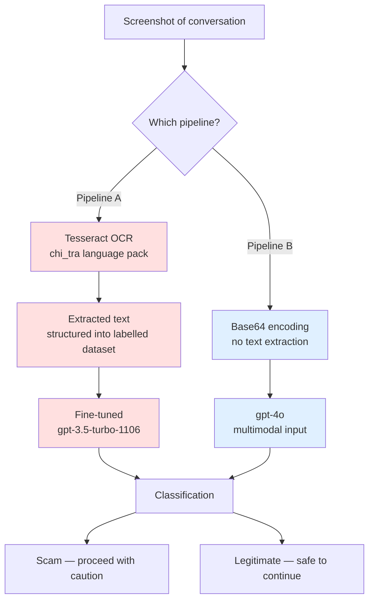

# AI Scam Alert — Intelligent Scam Message Warning System

Upload a screenshot of a suspicious conversation; the system classifies it as fraudulent or legitimate.

`Python` · `OpenAI API` · `Tesseract OCR` · `pandas` · `Google Colab`

---

## Background

Social-commerce platforms dominate online shopping in Taiwan, and fraud has followed. Criminal Investigation Bureau data for October 2024 lists online-shopping scams as the second most common fraud type at 14.41% of all reported cases, behind only investment scams.

Most victims encounter a scam as a conversation, not as a document — a seller who asks for payment through an unfamiliar link, or an account that pushes urgency. This project asks whether a language model can make that judgement from a screenshot alone.

---

## How it works

We built two architectures and compared them on the same dataset.



**Pipeline A — OCR + fine-tuned model.** Tesseract extracts Traditional Chinese text from the screenshot. The text is structured into a labelled dataset and used to fine-tune `gpt-3.5-turbo-1106` through the OpenAI fine-tuning API.

**Pipeline B — multimodal.** The image is base64-encoded and sent directly to `gpt-4o`. There is no text extraction step at all.

---

## Dataset

210 labelled screenshots of Traditional Chinese conversations, collected from Facebook groups and social-commerce platforms.

| Split | Size |
|---|---|
| Training | 104 |
| Test | 106 |

Ground-truth labels are parsed from the filename: `詐騙對話-XX.jpg` (scam) and `正常對話-XX.jpg` (legitimate).

---

## Results

| Pipeline | Model | Training set | Test set |
|---|---|---|---|
| B — multimodal | gpt-4o | 89.42% | **77.36%** |
| A — OCR + fine-tuned | gpt-3.5-turbo-1106 | 70.19% | 37.74% |

**OCR was the bottleneck, not the model.** Rather than continuing to tune Pipeline A, we traced where the accuracy was being lost. Traditional Chinese extraction was unreliable enough that errors upstream corrupted everything downstream — the classifier was often reading garbled text and judging it confidently. Upscaling images and applying grayscale filters to reduce noise did not fix this.

Removing the OCR step entirely was what closed the gap. Test accuracy more than doubled, from 37.74% to 77.36%.

---

## An unresolved observation

The fine-tuned `gpt-3.5-turbo` model scored 70.19% on our 104-sample training set. Re-running it on the same data weeks later, with no changes to the training data or parameters, returned 94.17%.

We could not determine whether this came from a change on OpenAI's side or from overfitting in our own data. We are reporting it as unresolved rather than quoting the higher figure. A result that improves for reasons we cannot account for is not one we are willing to put in front of a user.

The gap between Pipeline A's training accuracy (70.19%) and its test accuracy (37.74%) is itself consistent with overfitting, which is part of why we treat the 94.17% figure with suspicion.

---

## Running it

### Requirements

- Python packages: `openai`, `pytesseract`, `pandas`, `natsort`, `Pillow`
- Tesseract OCR engine with the Traditional Chinese pack (`tesseract-ocr`, `tesseract-ocr-chi-tra`) — required for Pipeline A only
- An OpenAI API key

### Steps

1. Open the notebook in Google Colab.
2. Add your API key to Colab Secrets under the name `OPENAI_API_KEY`, or export it in your environment:

   ```bash
   export OPENAI_API_KEY="your-key-here"
   ```

3. Upload your labelled images to Google Drive, following the naming convention above, and update `drive_folder_path` in the notebook.
4. Run the setup cells to install Tesseract and the Traditional Chinese language pack.
5. Run the `gpt4o model` section for Pipeline B, or the earlier cells for Pipeline A.

> **Note:** the fine-tuned model ID in the notebook (`ft:gpt-3.5-turbo-1106:ici::BdSO0syF`) belongs to the original project account and is not accessible to others. Pipeline B runs with any valid API key.

---

## Limitations

- The dataset is small (210 samples) and drawn from Taiwanese social-commerce contexts. Results may not generalise to other scam types, languages, or regions.
- 77.36% test accuracy is a proof of concept, not a deployable tool. A false negative here means telling a user a scam is safe.
- Classification is binary and returns no explanation. A user cannot see which part of the conversation triggered the judgement, which limits how much they can act on it.
- Both pipelines depend on an external API, so cost and latency scale with usage, and results can shift when the provider updates the underlying model — as we observed.

## Possible next steps

- Expand the dataset and rebalance it across scam categories
- Return a rationale alongside the label, not just a binary verdict
- Evaluate open-weight vision models to remove the external API dependency
- Measure precision and recall separately, since the cost of a false negative is not symmetric with a false positive

---

## Team

| Member | Role |
|---|---|
| 黃天慧 Alani | Project management |
| 胡楚逸 Luca | Concept, development |
| 黃芊婷 Patricia | Development |
| 黃晟恩 Andy | Poster design |

Built for the Introduction to AI course at National Chengchi University and presented at the university's Innovation Festival. Supervised by Professor Pien Chung-pei.
